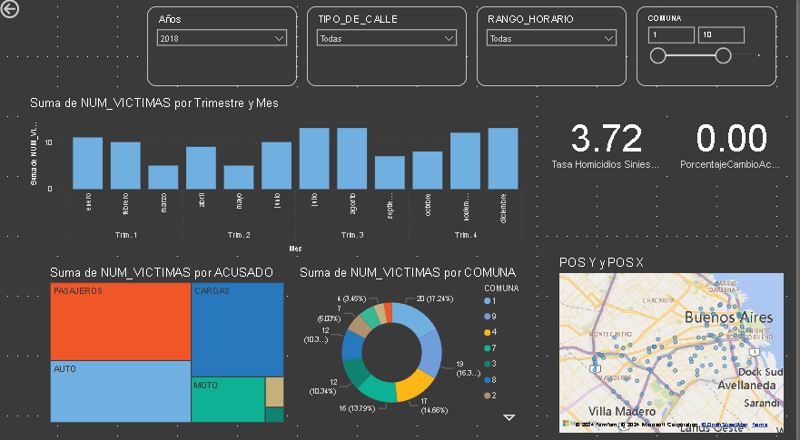

# Proyecto de Data Analyst: Análisis de Siniestros Viales

## Introducción
El objetivo de este proyecto es analizar los siniestros viales en la Ciudad Autónoma de Buenos Aires (CABA) con el fin de monitorear y reducir los accidentes mortales, especialmente aquellos que involucran motociclistas. Los KPIs principales son:

1. **Tasa de Homicidios en Siniestros Viales**
2. **Reducción de Accidentes Mortales de Motociclistas en un 7%**

## Objetivos
- Calcular y monitorear la tasa de homicidios en siniestros viales.
- Evaluar la reducción de accidentes mortales de motociclistas.
- Identificar patrones y tendencias en los siniestros viales para implementar medidas preventivas.

## Tecnologías Utilizadas
- **Python**: Lenguaje principal para la manipulación y análisis de datos.
  - **Pandas**: Para la manipulación y análisis de datos.
  - **NumPy**: Para operaciones matemáticas y estadísticas.
  - **Matplotlib**: Para la visualización de datos.
- **Jupyter Notebook**: Para la documentación y ejecución del análisis de datos.
- **Git**: Para el control de versiones.
- **Power BI**: Para la creación de dashboards interactivos y la visualización de KPIs.

## KPIs

1. **Tasa de Homicidios en Siniestros Viales**
   - Fórmula: \((\text{Número de homicidios en siniestros viales} / \text{Población total}) \times 100,000\)

2. **Reducción de Accidentes Mortales de Motociclistas**
   - Fórmula: \((\text{Número de accidentes mortales con víctimas en moto en el año anterior} - \text{Número de accidentes mortales con víctimas en moto en el año actual}) / \text{Número de accidentes mortales con víctimas en moto en el año anterior} \times 100\)

## Metodología de Análisis

### 1. Carga y Exploración de Datos
- **Trabajo Realizado**: 
  - Cargar los datos de siniestros viales y demográficos.
  - Realizar un análisis exploratorio de datos (EDA) para entender la estructura y contenido de los datos.

### 2. Preprocesamiento de Datos
- **Identificación y manejo de valores nulos**: 
  - **Trabajo Realizado**: Determinar el porcentaje de valores nulos en cada columna y decidir una estrategia para su imputación.
- **Detección y tratamiento de outliers**: 
  - **Trabajo Realizado**: Identificar valores atípicos y decidir si se eliminan o se corrigen.
- **Manejo de datos duplicados**: 
  - **Trabajo Realizado**: Identificar registros duplicados y eliminarlos para asegurar la integridad de los datos.
- **Normalización y estandarización de datos**: 
  - **Trabajo Realizado**: Asegurar que los datos están en un formato uniforme y adecuado para el análisis.

### 3. Análisis Descriptivo
- **Trabajo Realizado**: 
  - Calcular estadísticas descriptivas básicas.
  - Visualizar la distribución de los datos y las tendencias temporales.

### 4. Cálculo de KPIs
- **Trabajo Realizado**: 
  - Implementar las fórmulas para los KPIs definidos.
  - Visualizar los KPIs a lo largo del tiempo para identificar tendencias y cambios.

### 5. Visualización y Reporte
- **Trabajo Realizado**: 
  - Crear dashboards interactivos en Power BI para monitorear los KPIs.
  - Generar reportes detallados con los hallazgos y recomendaciones basadas en el análisis.

## Implementación en Power BI

### Proceso
1. **Importación de Datos**
   - **Trabajo Realizado**: Importar los datasets de siniestros viales y demográficos a Power BI.
2. **Transformación de Datos**
   - **Trabajo Realizado**: Utilizar el Editor de Consultas para limpiar y transformar los datos:
     - Eliminar valores nulos y registros duplicados.
     - Crear nuevas columnas necesarias para el análisis.
3. **Creación de Dashboards**
   - **Trabajo Realizado**: Diseñar dashboards interactivos que incluyan:
     - Visualización de la Tasa de Homicidios en Siniestros Viales.
     - Visualización de la Reducción de Accidentes Mortales de Motociclistas.
4. **Configuración de KPIs**
   - **Trabajo Realizado**: Configurar tarjetas de KPIs para mostrar los valores calculados.
5. **Interactividad**
   - **Trabajo Realizado**: Añadir filtros y segmentaciones para permitir una exploración interactiva de los datos.

### Ejemplo de Visualizaciones en Power BI
- **Gráficos de barras**: Comparar el número de siniestros por meses y tipo de accidente.
- **Tarjetas de KPIs**: Visualizar los valores actuales de los KPIs principales.
- **Gráficos de torta**: Mostrar la tendencia de homicidios en siniestros viales por comuna a lo largo del tiempo.
- **Gráficos de Treestamp**: Mostrar la proporcion de accidentes de los principales causantes, en el año, comuna, y rango horario específico

## Conclusiones

1. **Tendencia General**:
   - Los datos muestran una tendencia creciente/disminuyente en el número de siniestros viales a lo largo de los años. Esta tendencia puede ser influenciada por factores como el aumento del tráfico, mejoras en la infraestructura vial, y cambios en las políticas de seguridad.

2. **Siniestros Mortales**:
   - Los siniestros viales mortales han presentado un cambio significativo, especialmente entre los motociclistas. Se observa que los motociclistas son particularmente vulnerables, representando una porción considerable de las víctimas fatales.

3. **Variación Anual**:
   - La variación porcentual entre el año seleccionado y el año anterior indica que las intervenciones y políticas implementadas pueden estar teniendo un efecto positivo.

4. **Áreas Geográficas**:
   - Ciertas áreas geográficas presentan una mayor incidencia de siniestros viales, lo que podría estar relacionado con factores como la densidad del tráfico, la calidad de la infraestructura vial, y el cumplimiento de las normas de tránsito.

## Recomendaciones

1. **Mejorar la Infraestructura Vial**:
   - Invertir en la mejora de la infraestructura vial, como la construcción de carriles para bicicletas, mejoras en la señalización, y la implementación de medidas de control de velocidad en áreas de alta incidencia de accidentes.

2. **Campañas de Educación y Concientización**:
   - Implementar campañas educativas continuas que aborden la importancia de la seguridad vial, el respeto a las normas de tránsito, y el uso de equipo de protección, especialmente para los motociclistas.

3. **Refuerzo de la Legislación y el Cumplimiento**:
   - Asegurar el cumplimiento estricto de las leyes de tránsito mediante un aumento de la presencia policial en las carreteras y el uso de tecnologías como cámaras de vigilancia y radares de velocidad.

4. **Fomentar el Uso de Medios de Transporte Seguros**:
   - Promover el uso de medios de transporte público y bicicletas en lugar de vehículos privados, lo cual puede reducir la congestión del tráfico y, por ende, los siniestros viales.

5. **Análisis y Monitoreo Continuo**:
   - Realizar un análisis continuo de los datos de siniestros viales para identificar patrones y áreas de alto riesgo. Esto permitirá implementar intervenciones dirigidas y monitorear la efectividad de las mismas.

6. **Mejora en la Formación de Conductores**:
   - Aumentar los requisitos y la calidad de la formación de conductores, incluyendo simulaciones de situaciones de alto riesgo y educación sobre los efectos del alcohol y las drogas en la conducción.

7. **Promover Políticas de Seguridad Vial**:
   - Colaborar con organizaciones gubernamentales y no gubernamentales para desarrollar e implementar políticas que aborden de manera integral la seguridad vial, considerando todos los factores que contribuyen a los siniestros viales.

